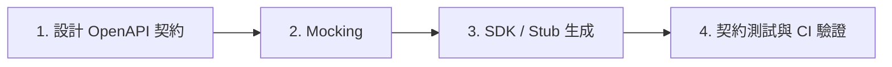

# SDD 四大步驟

規格驅動開發 (Spec-Driven Development / SDD) 用一份 OpenAPI 契約規格作為前後端與 QA 的單一真實來源 Single Source of Truth，四個步驟依序執行。本文件說明每個步驟的目的、要做的事與由誰負責，對應到這個套件裡 Skill 與 Agent 的分工可參考 [README](../README.md)。

## 步驟總覽



Step 1 與 Step 4 需要判斷力與多輪修正，交給對應的 Agent 處理；Step 2、Step 3 是單一指令就能完成的機械操作，直接執行即可，不需要動用 Agent。

---

## 步驟一：設計 OpenAPI 契約

**目的**：在任何前端或後端程式碼動筆之前，先把 API 的資源模型、狀態轉換與錯誤情境定義清楚，作為後續三個步驟共同依賴的單一真實來源。

**要做的事**：
- 讀取需求描述，或專案既有的 PRD、architecture 規格，列出這次要設計的 Resource 與對應的 Operation
- 在 `components/schemas` 定義共用的資料模型，Path 依 REST 慣例命名
- 執行 Spectral Linting，重複修正到規格乾淨為止

**由誰負責**：`openapi-contract-designer` Agent。牽動 Schema 結構、新增或刪除 Endpoint、變更必填欄位的異動都應該走這個 Agent；只是修一個欄位的 `description` 文字、修正明顯錯字這類小範圍異動，可以直接手動處理。

**產出**：一份通過 Spectral Lint 的 OpenAPI 3.1 規格檔案。

---

## 步驟二：Mocking

**目的**：規格一產出就能立即被前端串接，不需要等後端把 Controller 寫完。

**要做的事**：

```bash
npx @stoplight/prism-cli mock <規格檔案路徑> -p 4010
```

**由誰負責**：單一指令就能完成的機械操作，不需要動用 Agent，直接執行即可。

**產出**：一個依規格即時回應的 Mock Server，前端可以立刻開始對接。

---

## 步驟三：SDK / Stub 生成

**目的**：把規格轉成前端可以直接 import 的型別與 Client，或後端可以直接繼承的 Router／Validator，避免手動謄寫規格內容時產生的落差。

**要做的事**：

```bash
npx @openapitools/openapi-generator-cli generate \
  -i <規格檔案路徑> \
  -g typescript-fetch \
  -o <輸出目錄>
```

後端 Server Stub 依框架選擇對應的 Generator 種類；若專案已有既定的輸出目錄或 Generator 設定，沿用既有慣例，不要另立一套。

**由誰負責**：同樣是單一指令的機械操作，不需要動用 Agent。

**產出**：前端 SDK 或後端 Server Stub 原始碼。

---

## 步驟四：契約測試與 CI 驗證

**目的**：確認「規格宣告的樣子」與「實際跑起來的 API」是同一件事，防止規格漂移 Spec Drift，即實作與規格產生落差卻沒有被察覺。

**要做的事**：
- 若專案已有契約測試工具鏈，先直接執行既有測試指令
- 尚未有契約測試時，依情境／操作／驗證 (Arrange-Act-Assert) 驗收規格範本建立最小可行的一組
- 交付規格檔案路徑，與比對來源，執行中的 API Base URL 或既有契約測試指令，給 Agent 複核

**由誰負責**：`contract-drift-auditor` Agent。這個 Agent 只回報落差，不修改任何檔案；落差牽涉規格需要更新時，回到步驟一重新設計，落差是實作有誤時，交還實作者修正後重新跑這個步驟。

**產出**：一份契約漂移稽核報告，列出每一筆落差是可自動判定成立，還是需要使用者決策。

---

## 收尾檢查

一輪 SDD 流程要滿足以下三件事，才算這一輪完成：

- 規格已通過 Spectral Lint
- Mock Server 或既有的真實服務能正常回應規格宣告的 Endpoint
- 契約測試通過，或所有回報的落差都已交還對應角色處理，並有明確去向

## 什麼情況可以省略完整流程

- 只是本地一次性除錯、不涉及對外契約、不會有其他團隊依賴這份規格時，不需要走完整四步驟
- 專案規模非常小、只有單一 Consumer 且前後端由同一個人開發時，可以只做步驟一與步驟四，省略步驟二、步驟三，並說明省略的原因
