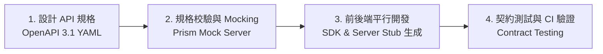

# 規格驅動開發教學 Skill (Spec-Driven Development / SDD Skill)

本 Skill 提供在現代軟體工程中進行 **Spec-Driven Development (SDD / 規格驅動開發)** 的完整教學與實務指引。
SDD 倡導「規格優先 (Spec-First)」理念——在撰寫任何前端或後端程式碼之前，先定義好精確的 API 契約規格 (如 OpenAPI 3.1、AsyncAPI、情境／操作／驗證驗收規格)。這能徹底打破前後端開發依賴瓶頸、實現並行開發 (Parallel Development) 並保障系統契約一致性。

---

## 🎯 規格驅動開發 (SDD) 核心四大步驟

1. **Spec-First 設計**：前後端團隊與 PM 一起編寫並審查 OpenAPI 3.1 契約，定為單一真實來源 (Single Source of Truth - SSOT)。
2. **即時 Mocking**：使用 Prism / MSW 在 1 分鐘內根據 Spec 啟動 Mock API 伺服器，前端無須等待後端即可開工。
3. **自動化程式碼生成**：從 Spec 自動生成 TypeScript Types、前端 Client SDK、後端 Validator 與 Router Stubs。
4. **契約測試 (Contract Testing)**：在 CI/CD 流水線中驗證真實 API 回傳與 Spec 是否出現「規格漂移 (Spec Drift)」。

---

## 📚 核心技術指南目錄

### 1. OpenAPI 3.1 契約設計與 Spectral Linting
* OpenAPI 3.1 YAML 語法、Paths, Schemas, Components 設計。
* 使用 Spectral 進行規格靜態檢查。

*詳細 OpenAPI 設計參閱：* [openapi-spec-design-guide.md](./references/openapi-spec-design-guide.md)

---

### 2. API Mocking、SDK 自動生成與契約測試
* 使用 Prism 啟動本地 Mock Server (`npx @stoplight/prism-cli mock ...`)。
* 從 OpenAPI 生成 TypeScript SDK。
* 契約測試 (Contract Testing) 防止規格與程式碼脫節。

*詳細 Mocking 與契約測試參閱：* [contract-testing-mocking.md](./references/contract-testing-mocking.md)

---

### 3. 人性化驗收規格與情境／操作／驗證 (Arrange-Act-Assert)
* 為 PM 與 QA 設計不需要學習 Gherkin 語法，也能直接對應到測試案例的驗收規格書。

*詳細範本參閱：* [acceptance-spec-template.md](./references/acceptance-spec-template.md)

---

## 🛡️ SDD 教學最佳實踐 (Best Practices)

- **Spec 即文檔，文檔即代碼**：禁止手動維護容易過期的 Markdown API 文檔，全面轉為 OpenAPI 可執行規格。
- **預防 Spec Drift (規格漂移)**：把 Spec 驗證納入 CI/CD 流水線，防止後端擅自修改欄位名稱。
- **預設語言**：繁體中文，Taiwanese Traditional Chinese，OpenAPI 語法與 YAML 欄位保留原本格式。
